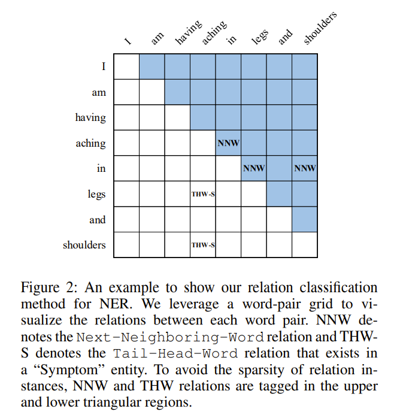
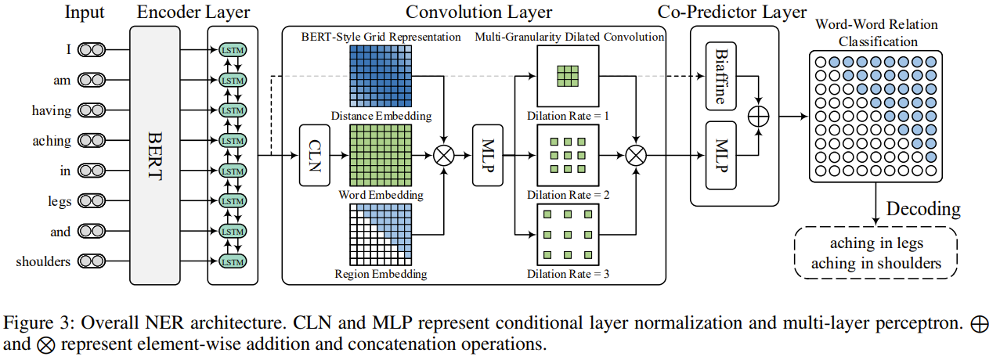

 # Unified Named Entity Recognition as Word-Word Relation Classification

Source code for AAAI 2022 paper: [Unified Named Entity Recognition as Word-Word Relation Classification](https://arxiv.org/pdf/2112.10070.pdf)

> So far, named entity recognition (NER) has been involved with three major types, including flat, overlapped (aka. nested), and discontinuous NER, which have mostly been studied individually. Recently, a growing interest has been built for unified NER, tackling the above three jobs concurrently with one single model. Current best-performing methods mainly include span-based and sequence-to-sequence models, where unfortunately the former merely focus on boundary identification and the latter may suffer from exposure bias. In this work, we present a novel alternative by modeling the unified NER as word-word relation classification, namely W2NER. The architecture resolves the kernel bottleneck of unified NER by effectively modeling the neighboring relations between entity words with Next-Neighboring-Word (NNW) and Tail-Head-Word-* (THW-*) relations. Based on the W2NER scheme we develop a neural framework, in which the unified NER is modeled as a 2D grid of word pairs. We then propose multi-granularity 2D convolutions for better refining the grid representations. Finally, a co-predictor is used to sufficiently reason the word-word relations. We perform extensive experiments on 14 widely-used benchmark datasets for flat, overlapped, and discontinuous NER (8 English and 6 Chinese datasets), where our model beats all the current top-performing baselines, pushing the state-of-the-art performances of unified NER.

### Label Scheme
<p align="center">
  
</p>

### Architecture
<p align="center">
  
</p>

## 1. Environments

```
- python (3.8.12)
- cuda (11.4)
```

## 2. Dependencies

```
- numpy (1.21.4)
- torch (1.10.0)
- gensim (4.1.2)
- transformers (4.13.0)
- pandas (1.3.4)
- scikit-learn (1.0.1)
- prettytable (2.4.0)
```

## 3. Dataset

- [Conll 2003](https://www.clips.uantwerpen.be/conll2003/ner/)
- [OntoNotes 4.0](https://catalog.ldc.upenn.edu/LDC2011T03)
- [OntoNotes 5.0](https://catalog.ldc.upenn.edu/LDC2013T19)
- [ACE 2004](https://catalog.ldc.upenn.edu/LDC2005T09)
- [ACE 2005](https://catalog.ldc.upenn.edu/LDC2006T06)
- [GENIA](http://www.geniaproject.org/genia-corpus)
- [CADEC](https://pubmed.ncbi.nlm.nih.gov/25817970/)
- [ShARe13](https://clefehealth.imag.fr/?page_id=441)
- [ShARe14](https://sites.google.com/site/clefehealth2014/)

We provide some datasets processed in this [link](https://drive.google.com/drive/folders/1NdvUeIUUL3mlS8QwwnqM628gCK7_0yPv?usp=sharing).

## 4. Preparation

- Download dataset
- Process them to fit the same format as the example in `data/`
- Put the processed data into the directory `data/`

## 5. Training

```bash
>> python main.py --config ./config/example.json
```
## 6. License

This project is licensed under the MIT License - see the [LICENSE](LICENSE) file for details.

## 7. Citation

If you use this work or code, please kindly cite this paper:

```
@inproceedings{li2022unified,
  title={Unified named entity recognition as word-word relation classification},
  author={Li, Jingye and Fei, Hao and Liu, Jiang and Wu, Shengqiong and Zhang, Meishan and Teng, Chong and Ji, Donghong and Li, Fei},
  booktitle={Proceedings of the AAAI Conference on Artificial Intelligence},
  volume={36},
  number={10},
  pages={10965--10973},
  year={2022}
}
```


